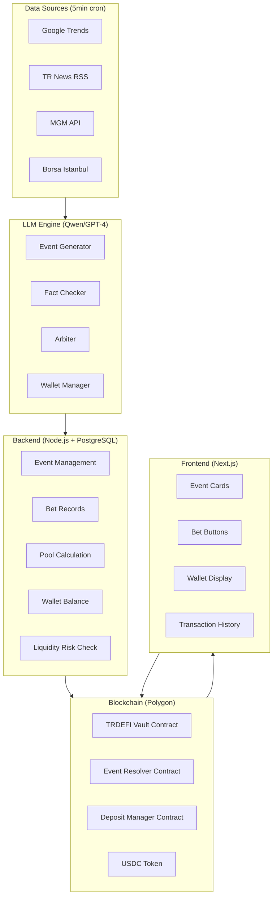

# TRDEFI Prediction Market — Method of Statement

**Version:** 2.0  
**Date:** 2026-05-21  
**Status:** Active Development  
**Repository:** https://github.com/TRDEFI/pm-turkish

---

## 1. Project Overview

TRDEFI Prediction Market is a Turkey-focused prediction platform where users make YES/NO predictions on daily events (weather, exchange rates, sports results, technology news, etc.). The platform is an information/trivia game — not gambling or betting.

**Principle:** Users play against each other. The platform only provides infrastructure, security, and fairness.

---

## 2. Core Rules (Parimutuel System)

### 2.1 Betting Mechanism
- Each event has **YES** or **NO** options.
- No dynamic pricing — fixed pool system.
- Event duration is **maximum 24 hours**.

### 2.2 Payout Calculation
When an event ends:
1. **10% platform commission** is deducted from the losing side's total bet amount.
2. The remaining **90%** of the losing pool is added to the winning side's bet pool.
3. Winners receive distribution proportional to their bet weight.

```
Payout = (UserBet / WinningTotalBet) × (WinningTotalBet + LosingTotalBet × 0.90)
```

### 2.3 Example
| Side | Total Bets |
|------|-----------|
| YES | 500 USDC |
| NO | 300 USDC |
| **Result** | YES Wins |

- Loser (NO): 300 USDC
  - Platform commission (10%): **30 USDC**
  - Added to winner pool: **270 USDC**
- Winner (YES) total distribution: 500 + 270 = **770 USDC**
- Alice (100 USDC YES): 100 + (100/500) × 270 = **154 USDC** (+54 profit)
- Bob (400 USDC YES): 400 + (400/500) × 270 = **616 USDC** (+216 profit)

### 2.4 Liquidity Risk Rule
If all users bet on the same side during an event (only YES or only NO):
- If that side **loses** → platform takes all funds (normal operation).
- If that side **wins** → **event is cancelled**, all bets are refunded.
- **Reason:** There is no losing pool to pay from. The platform does not pay from its own pocket.

This rule protects both the platform and ensures fairness for users.

---

## 3. LLM — 4 Roles

### 3.1 Event Generator
**Task:** Creates predictable events from real-time data.

**Data Sources:**
- Google Trends (Turkey, 5min interval)
- News site RSS (NTV, Hürriyet, T24, Sözcü, Bianet)
- Twitter/X Trends API
- MGM (Meteorology General Directorate) API
- Borsa Istanbul RSS
- Exchange rate APIs

**Filtration Criteria (LLM Decision Matrix):**
- Is it logical and open-ended?
- Can it be resolved within 24 hours?
- Is there a provable source?
- Is it hard to manipulate?
- Are there at least 2 independent verifiable sources?

### 3.2 Fact Checker
**Task:** Performs multi-source validation for each event upon creation.

- Comparison of at least 3 independent sources
- Timestamp verification (news date must be before event date)
- If conflicting information → event is rejected

### 3.3 Arbiter
**Task:** Determines the result when the event period ends and provides reference links.

- LLM scans all sources again after 24 hours
- Result is determined (YES or NO)
- Reference links are shown on the event card

### 3.4 Wallet Manager
**Task:** Manages user balances after event results.

- When event ends:
  - Loser balances are deducted by bet amount
  - Winner balances are credited with winnings
  - Platform commission is transferred to platform wallet
  - All transactions are logged (audit purpose)
- When user requests withdrawal → on-chain transfer via blockchain

---

## 4. Architecture



---

## 5. Legal Framework

- The platform is a **prediction platform** — not gambling or betting.
- Users make information-based predictions, not chance-based.
- Disclaimer on main page: "This is a prediction platform. Not gambling."
- Offshore entity (Curacao/BVI) may be considered in the future.
- 18+ age restriction (may be applied in the future).

---

## 6. Security

- **Smart Contract Audit** — Mandatory before deployment
- **Timelock** — 24h delay for large withdrawals
- **Pause Mechanism** — Platform can be stopped in emergencies
- **Multisig** — Vault contract owner should be multisig (2/3 or 3/5)
- **Rate Limiting** — Daily bet limit per user
- **Audit Log** — All transactions stored in PostgreSQL

---

## 7. Technology Stack

| Layer | Technology |
|-------|-----------|
| Frontend | Next.js 16 + TailwindCSS |
| Backend | Node.js + Express + PostgreSQL |
| LLM | Qwen / GPT-4 + Fine-tune |
| Blockchain | Polygon (Chain ID: 137) |
| Token | USDC (ERC-20) |
| Smart Contract | Solidity 0.8.24 + OpenZeppelin 5.x |
| Data Sources | Google Trends API, RSS Feeds, MGM API |
| Hosting | Netlify (Frontend) + VPS/Cloud (Backend + DB) |
| CI/CD | GitHub Actions |

---

## 8. Development Phases

| Phase | Duration | Content |
|-------|----------|---------|
| **1** | Week 1-2 | Off-chain MVP: Fake crypto, event generator, bet UI |
| **2** | Week 3-4 | Polygon vault contract (deposit/withdrawal) |
| **3** | Week 5-6 | LLM arbitrage + multi-source fact checking |
| **4** | Week 7-8 | Beta launch (user testing + feedback) |
| **5** | Week 9-10 | Audit + production hardening |
| **6** | Week 11+ | Public launch |

---

## 9. Current Project Status

### 9.1 Completed
- [x] 3 Solidity contracts developed (TRDEFIVault, EventResolver, TRDEFIDepositManager)
- [x] 66 tests passing (22 unit + 44 security-focused)
- [x] Security audit completed (Slither: 60→42 findings, 30% reduction)
- [x] CI/CD pipelines configured (ci.yml + deploy.yml)
- [x] GitHub repository initialized and pushed
- [x] Hardhat upgraded to 2.28.x with OpenZeppelin 5.x support
- [x] viaIR compilation enabled for complex contracts

### 9.2 In Progress
- [ ] Polygon Amoy testnet deployment (blocked: insufficient testnet MATIC)
- [ ] Frontend MVP development (Next.js + Wagmi/viem)
- [ ] LLM integration for event resolution

### 9.3 Blocked
- [ ] Testnet deployment requires additional MATIC from faucets
- [ ] Contract verification on Polygonscan pending deployment

### 9.4 Risk Matrix

| Risk | Impact | Probability | Mitigation |
|------|--------|-------------|------------|
| Smart Contract Vulnerability | High | Low | Audit + 66 security tests + Slither scan |
| Oracle Manipulation | High | Medium | Multisig resolution + 24h challenge window |
| Insufficient Liquidity | Medium | Medium | Draw rule + event cancellation |
| Regulatory Changes | High | Low | Legal framework + disclaimer |
| LLM Hallucination | Medium | Medium | Multi-source validation + fact checker |
| Gas Price Spikes | Low | Low | Polygon network (~$0.002/tx) |

---

## 10. Deployment Checklist

### Pre-Deployment
- [ ] All 66 tests passing
- [ ] Slither security scan completed
- [ ] Manual code review completed
- [ ] .env file configured with correct values
- [ ] Deployer wallet funded with testnet MATIC
- [ ] GitHub secrets configured (RPC URL, Private Key, API Key)

### Deployment
- [ ] Contracts compiled successfully
- [ ] Deployment script executed
- [ ] Contract addresses recorded
- [ ] Contracts verified on Polygonscan
- [ ] Owner transferred to multisig wallet

### Post-Deployment
- [ ] Frontend connected to deployed contracts
- [ ] End-to-end testing completed
- [ ] Monitoring setup (events, transactions)
- [ ] Backup plan documented

---

*Last Updated: 2026-05-21*
