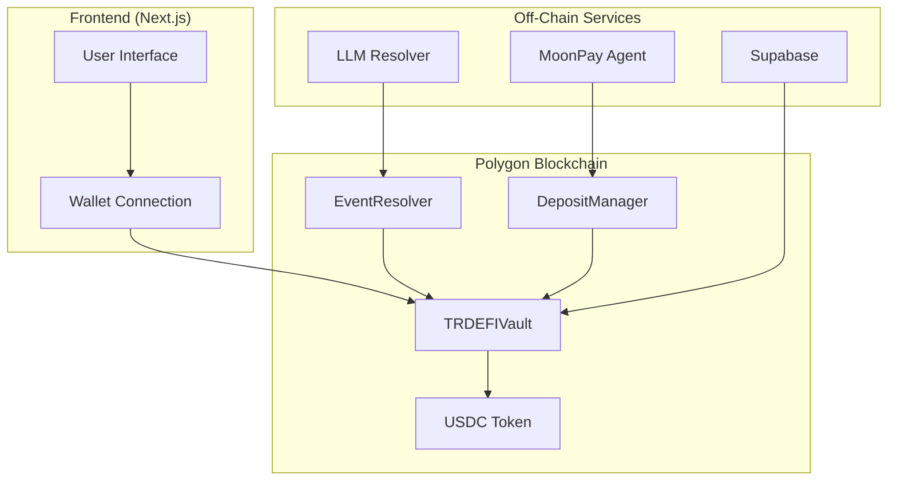

# TRDEFI Smart Contracts

Polygon-based parimutuel prediction market vault with LLM-driven resolution.

[]()
[]()
[]()
[]()
[]()

---

## Quick Start

### Prerequisites
- Node.js 20+
- npm or yarn
- MetaMask wallet

### Local Development

```bash
# Clone repository
git clone https://github.com/TRDEFI/pm-turkish.git
cd pm-turkish/contracts

# Install dependencies
npm install

# Run tests
npm test

# Start local Hardhat network
npx hardhat node

# Deploy to local network (in another terminal)
npm run deploy:local
```

### Testnet Deployment

```bash
# Configure environment
cp .env.example .env
# Edit .env with your values

# Deploy to Polygon Amoy
npm run deploy:amoy
```

---

## Architecture



---

## Contracts

### 1. TRDEFIVault.sol
**Main contract** — All betting operations occur here.

| Function | Access | Description |
|----------|--------|-------------|
| `deposit(amount)` | User | Deposit USDC |
| `withdraw(amount)` | User | Withdraw available balance |
| `createEvent(q, cat, deadline, price)` | Owner | Create new event |
| `placeBet(eventId, side, amount)` | User | Place bet (YES/NO) |
| `resolveEvent(eventId, yes, data)` | Resolver | Resolve event |
| `claimWinnings(betId)` | User | Claim winnings |
| `claimMultipleWinnings(betIds)` | User | Claim multiple winnings |
| `withdrawPlatformFees()` | Owner | Withdraw commission |
| `pause()` / `unpause()` | Owner | Emergency pause |

**Parimutuel Math:**
```
Losing Pool = Total bets on losing side
Platform Fee = Losing Pool × 10%
Net Losing Pool = Losing Pool - Fee
Winning Pool = Winning Bets + Net Losing Pool
User Payout = (UserBet / WinningTotalBet) × Winning Pool
```

**Draw Rule:** If only one side has bets → event is DRAW → all bets refunded.

### 2. EventResolver.sol
**Oracle layer** — LLM resolution + multisig fallback.

| Function | Access | Description |
|----------|--------|-------------|
| `submitResolution(eventId, yes, reasoning, sources)` | Anyone | Submit resolution |
| `confirmResolution(resolutionId)` | Signer | Confirm resolution |
| `challengeResolution(resolutionId, reason)` | Signer | Challenge resolution |
| `finalizeAfterTimeout(resolutionId)` | Anyone | Finalize after timeout |

**Resolution Flow:**
1. LLM resolver → `submitResolution()` → PENDING
2. 24-hour challenge window starts
3. Multisig signers `confirm()` or `challenge()`
4. 2+ confirmations → automatically FINALIZED
5. Challenge window expires → anyone can finalize
6. Majority challenge → REJECTED

### 3. TRDEFIDepositManager.sol
**MoonPay integration** — Fiat onramp management.

| Function | Access | Description |
|----------|--------|-------------|
| `deposit(user, moonpayTxId)` | Anyone | Receive USDC deposit |
| `creditDeposit(moonpayTxId)` | WebhookSigner | Credit verified deposit |
| `batchCreditDeposits(txIds)` | WebhookSigner | Batch credit deposits |

---

## Contract Addresses

### Polygon Mainnet
| Contract | Address |
|----------|---------|
| TRDEFIVault | TBD |
| EventResolver | TBD |
| TRDEFIDepositManager | TBD |
| USDC | `0x3c499c542cEF5E3811e1192ce70d8cC03d5c3359` |

### Polygon Amoy (Testnet)
| Contract | Address |
|----------|---------|
| TRDEFIVault | TBD |
| EventResolver | TBD |
| TRDEFIDepositManager | TBD |
| USDC | `0x41e94eb21f52f96f82c0f39d59b4d2268e081474` |

---

## Security

- OpenZeppelin Ownable2Step (2-step ownership transfer)
- Pausable (emergency stop)
- ReentrancyGuard (reentrancy protection)
- SafeERC20 (token transfer protection)
- Min/Max bet limits
- Deadline enforcement
- Double-claim protection
- Multisig resolution (2-of-N)
- 24-hour challenge window
- Resolution hash (audit trail)

### Security Audit Results
- **Slither Scan:** 60 → 42 findings (30% reduction)
- **Manual Review:** Completed
- **Test Coverage:** 66 tests (100% passing)
- **Security Tests:** 44 additional security-focused tests

### Gas Estimates (Polygon)
| Function | Estimated Gas |
|----------|--------------|
| deposit() | ~65,000 |
| withdraw() | ~45,000 |
| createEvent() | ~120,000 |
| placeBet() | ~85,000 |
| resolveEvent() | ~95,000 |
| claimWinnings() | ~110,000 |
| claimMultipleWinnings(5) | ~350,000 |

Polygon gas fee: ~$0.002/tx → All transactions <$0.01

---

## Documentation

- [Method of Statement](METHOD_OF_STATEMENT.md)
- [Architecture](docs/ARCHITECTURE.md)
- [Contract Specifications](docs/CONTRACTS.md)
- [Deployment Guide](docs/DEPLOYMENT.md)
- [Security Report](docs/SECURITY.md)
- [Testing Report](docs/TESTING.md)
- [Development Guide](docs/DEVELOPMENT.md)
- [User Guide](docs/USER_GUIDE.md)

---

## Contributing

1. Fork the repository
2. Create your feature branch (`git checkout -b feature/amazing-feature`)
3. Commit your changes (`git commit -m 'Add amazing feature'`)
4. Push to the branch (`git push origin feature/amazing-feature`)
5. Open a Pull Request

### Development Workflow
- All changes must pass CI tests
- Security scan must pass
- Code review required for all PRs
- Follow Solidity style guide

---

## License

This project is licensed under the MIT License — see the LICENSE file for details.

---

*Last Updated: 2026-05-21*
