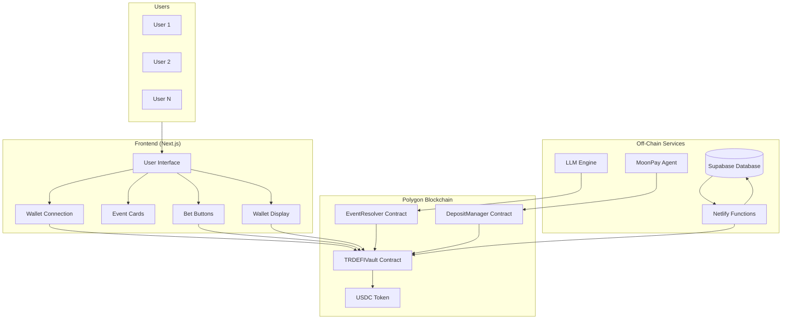
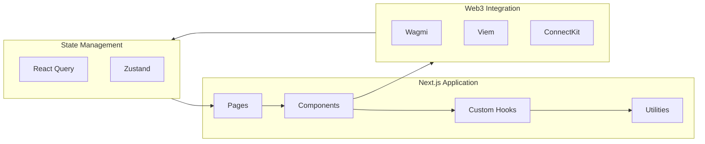
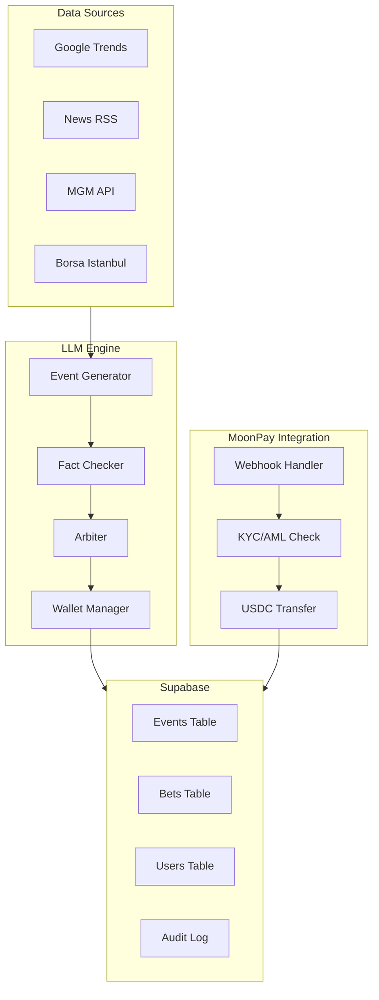
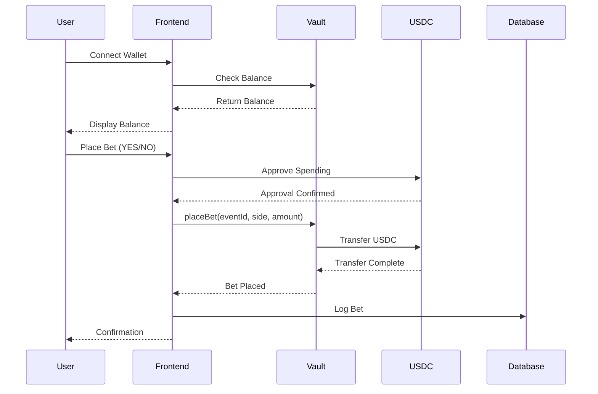
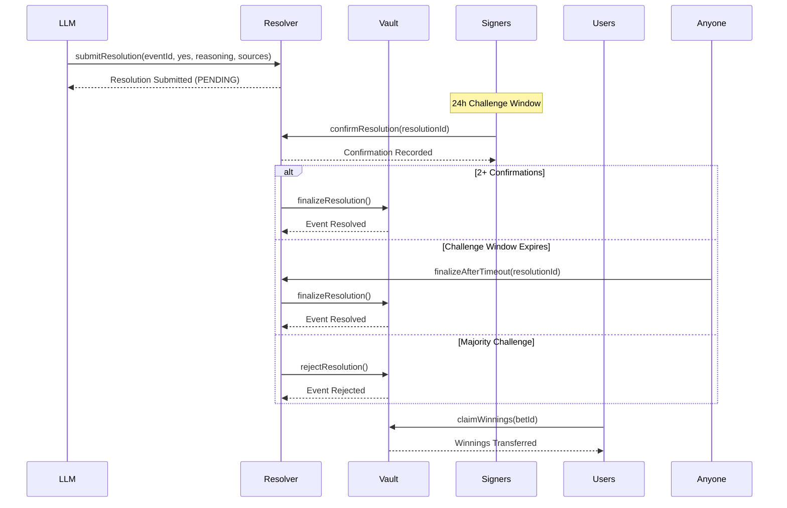
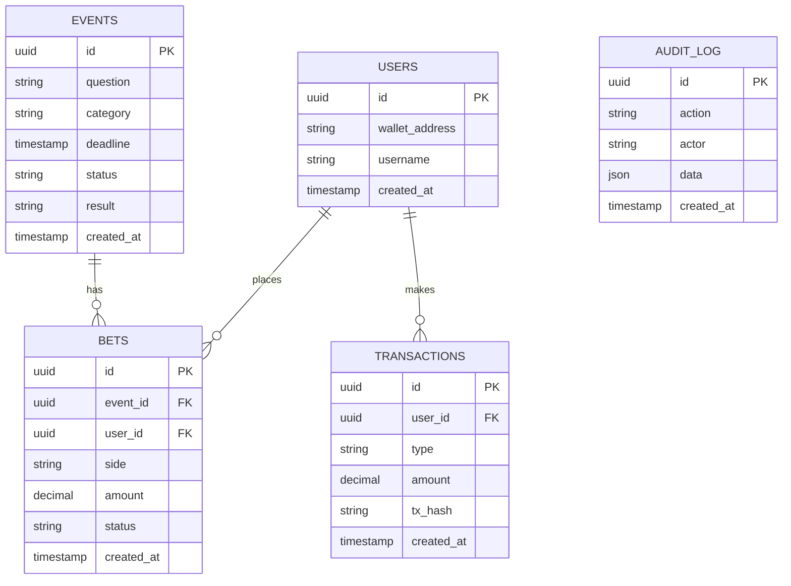
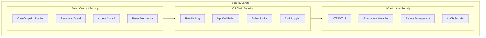

# TRDEFI Architecture

System architecture documentation for the TRDEFI Prediction Market platform.

---

## System Overview



---

## Component Architecture

### Frontend Layer



**Key Components:**
- `EventCard`: Displays event details, betting options, and status
- `WalletConnect`: Handles wallet connection and disconnection
- `BetModal`: Modal for placing bets with amount input
- `TransactionHistory`: Displays user's transaction history
- `DepositModal`: Modal for depositing USDC via MoonPay

---

### Smart Contract Layer

```mermaid
graph TB
    subgraph Vault["TRDEFIVault.sol"]
        Deposit[deposit()]
        Withdraw[withdraw()]
        CreateEvent[createEvent()]
        PlaceBet[placeBet()]
        Resolve[resolveEvent()]
        Claim[claimWinnings()]
    end

    subgraph Resolver["EventResolver.sol"]
        Submit[submitResolution()]
        Confirm[confirmResolution()]
        Challenge[challengeResolution()]
        Finalize[finalizeAfterTimeout()]
    end

    subgraph DepositMgr["TRDEFIDepositManager.sol"]
        MPDeposit[deposit()]
        Credit[creditDeposit()]
        BatchCredit[batchCreditDeposits()]
    end

    Resolver --> Vault
    DepositMgr --> Vault
    Vault --> USDC[USDC Token]
```

**Contract Interactions:**
1. User deposits USDC → `TRDEFIVault.deposit()`
2. Owner creates event → `TRDEFIVault.createEvent()`
3. User places bet → `TRDEFIVault.placeBet()`
4. LLM submits resolution → `EventResolver.submitResolution()`
5. Signers confirm/challenge → `EventResolver.confirmResolution()`
6. Event resolved → `TRDEFIVault.resolveEvent()`
7. User claims winnings → `TRDEFIVault.claimWinnings()`

---

### Off-Chain Services



---

## Data Flow

### User Betting Flow



### Event Resolution Flow



---

## Database Schema

### Supabase Tables



---

## API Endpoints

### Netlify Functions

| Endpoint | Method | Description |
|----------|--------|-------------|
| `/api/events` | GET | List all events |
| `/api/events/:id` | GET | Get event details |
| `/api/events` | POST | Create new event (admin) |
| `/api/bets` | POST | Place a bet |
| `/api/bets/:id` | GET | Get bet details |
| `/api/user/:address` | GET | Get user info |
| `/api/user/:address/bets` | GET | Get user bets |
| `/api/moonpay/webhook` | POST | MoonPay webhook handler |

---

## Security Architecture



---

## Deployment Architecture

```mermaid
graph TB
    subgraph Development["Development"]
        Local[Local Hardhat]
        Test[Test Suite]
        Lint[Linting]
    end

    subgraph CI["CI/CD Pipeline"]
        Build[Build]
        TestCI[Run Tests]
        Scan[Security Scan]
        Deploy[Deploy]
    end

    subgraph Environments["Environments"]
        Amoy[Polygon Amoy (Testnet)]
        Mainnet[Polygon Mainnet]
    end

    subgraph Monitoring["Monitoring"]
        Events[Event Monitoring]
        Alerts[Alerts]
        Logs[Transaction Logs]
    end

    Development --> CI
    CI --> Amoy
    Amoy --> Mainnet
    Mainnet --> Monitoring
```

---

*Last Updated: 2026-05-21*
