# Development Guide

Developer documentation for contributing to TRDEFI smart contracts.

---

## Development Workflow

```mermaid
graph LR
    Issue[Issue/Feature Request] --> Branch[Create Feature Branch]
    Branch --> Code[Write Code]
    Code --> Test[Write Tests]
    Test --> Commit[Commit Changes]
    Commit --> PR[Create Pull Request]
    PR --> Review[Code Review]
    Review --> CI[CI/CD Pipeline]
    CI --> Merge[Merge to Main]
    Merge --> Deploy[Deploy]
```



---

## Branching Strategy

### Branch Naming Convention
```
feature/feature-name
bugfix/bug-description
hotfix/critical-fix
release/version-number
```

### Examples
```bash
# Feature branch
git checkout -b feature/add-batch-betting

# Bugfix branch
git checkout -b bugfix/fix-deadline-check

# Hotfix branch
git checkout -b hotfix/security-patch

# Release branch
git checkout -b release/v1.0.0
```

---

## Code Style Guidelines

### Solidity Style Guide
- Use Solidity 0.8.24
- Follow checks-effects-interactions pattern
- Use custom errors instead of revert strings
- Name functions in camelCase
- Name events in PascalCase
- Use `indexed` for event parameters that will be filtered
- Add NatSpec comments for all public/external functions

### Example Contract Structure
```solidity
// SPDX-License-Identifier: MIT
pragma solidity ^0.8.24;

import "@openzeppelin/contracts/access/Ownable2Step.sol";

/**
 * @title TRDEFIVault
 * @notice Main vault contract for TRDEFI prediction market
 * @dev Implements parimutuel betting system
 */
contract TRDEFIVault is Ownable2Step {
    /**
     * @notice Deposit USDC into the vault
     * @param amount Amount of USDC to deposit
     * @dev Transfers USDC from user to vault
     */
    function deposit(uint256 amount) external {
        // Implementation
    }
}
```

### JavaScript/TypeScript Style Guide
- Use async/await for asynchronous operations
- Use descriptive variable names
- Add comments for complex logic
- Follow ESLint configuration
- Use prettier for formatting

---

## Commit Message Conventions

### Format
```
<type>(<scope>): <description>

[optional body]

[optional footer]
```

### Types
| Type | Description |
|------|-------------|
| `feat` | New feature |
| `fix` | Bug fix |
| `docs` | Documentation changes |
| `style` | Code style changes (formatting) |
| `refactor` | Code refactoring |
| `test` | Test changes |
| `chore` | Maintenance tasks |

### Examples
```bash
# Feature commit
git commit -m "feat(vault): add batch betting functionality"

# Bug fix commit
git commit -m "fix(resolver): correct deadline comparison logic"

# Documentation commit
git commit -m "docs(readme): update deployment instructions"

# Test commit
git commit -m "test(vault): add reentrancy protection tests"
```

---

## Pull Request Template

### PR Title
```
<type>(<scope>): <description>
```

### PR Description
```markdown
## Description
Brief description of changes

## Type of Change
- [ ] Bug fix
- [ ] New feature
- [ ] Documentation update
- [ ] Refactoring
- [ ] Test update

## Testing
- [ ] All tests passing
- [ ] New tests added
- [ ] Manual testing completed

## Checklist
- [ ] Code follows style guidelines
- [ ] Self-review completed
- [ ] Documentation updated
- [ ] No breaking changes (or documented)
```

---

## Code Review Checklist

### Smart Contracts
- [ ] Follows checks-effects-interactions pattern
- [ ] Proper access control implemented
- [ ] Events emitted for state changes
- [ ] Custom errors used instead of revert strings
- [ ] Gas optimization considered
- [ ] NatSpec comments present
- [ ] No hardcoded addresses (use constants)
- [ ] Proper error handling

### Tests
- [ ] All tests passing
- [ ] Edge cases covered
- [ ] Security tests included
- [ ] Test names descriptive
- [ ] No commented-out tests
- [ ] Mock contracts used appropriately

### Documentation
- [ ] README updated if needed
- [ ] Function documentation complete
- [ ] Examples provided
- [ ] Breaking changes documented

---

## Local Development Setup

### 1. Clone Repository
```bash
git clone https://github.com/TRDEFI/pm-turkish.git
cd pm-turkish/contracts
```

### 2. Install Dependencies
```bash
npm install
```

### 3. Configure Environment
```bash
cp .env.example .env
# Edit .env with your values
```

### 4. Run Tests
```bash
npm test
```

### 5. Start Local Network
```bash
npx hardhat node
```

---

## Debugging Tips

### Hardhat Console
```bash
npx hardhat console --network localhost
```

### Logging
```javascript
// In test files
console.log("Balance:", await vault.balances(user.address));

// In deployment scripts
console.log("Contract deployed at:", await contract.getAddress());
```

### Transaction Debugging
```javascript
// Get transaction receipt
const receipt = await tx.wait();
console.log("Gas used:", receipt.gasUsed.toString());

// Get events
const events = receipt.logs;
console.log("Events:", events);
```

### Common Issues

#### "Stack too deep" Error
- **Cause:** Too many local variables
- **Solution:** Use `viaIR: true` in hardhat.config.js

#### "Transaction reverted" Error
- **Cause:** Contract logic error
- **Solution:** Check error messages and revert conditions

#### "Gas estimation failed" Error
- **Cause:** Insufficient gas or logic error
- **Solution:** Increase gas limit or fix logic

---

## CI/CD Pipeline

### GitHub Actions Workflows

#### CI Workflow
Triggers on push/PR to `main`:
1. Checkout code
2. Setup Node.js
3. Install dependencies
4. Compile contracts
5. Run tests
6. Run Slither security scan

#### Deploy Workflow
Triggers on push to `main`:
1. Checkout code
2. Setup Node.js
3. Install dependencies
4. Compile contracts
5. Run tests
6. Deploy to Polygon Amoy
7. Verify on Polygonscan

### Required Secrets
| Secret | Description |
|--------|-------------|
| `PMTURKISH` | Polygon RPC URL |
| `PMTURKISH01` | Deployer private key |
| `PMTURKISH02` | Polygonscan API key |

---

## Release Process

### 1. Prepare Release
```bash
# Create release branch
git checkout -b release/v1.0.0

# Update version in package.json
npm version 1.0.0

# Commit changes
git commit -am "chore: bump version to 1.0.0"
```

### 2. Test Release
```bash
# Run all tests
npm test

# Run security scan
slither .

# Deploy to testnet
npm run deploy:amoy
```

### 3. Merge to Main
```bash
# Merge release branch
git checkout main
git merge release/v1.0.0

# Push to remote
git push origin main
```

### 4. Create GitHub Release
- Go to GitHub Releases
- Create new release with tag `v1.0.0`
- Add release notes
- Publish release

---

## Contributing

### 1. Fork Repository
- Fork the repository on GitHub
- Clone your fork locally

### 2. Create Feature Branch
```bash
git checkout -b feature/your-feature
```

### 3. Make Changes
- Write code following style guidelines
- Add tests for new functionality
- Update documentation

### 4. Commit Changes
```bash
git add .
git commit -m "feat: your feature description"
```

### 5. Push and Create PR
```bash
git push origin feature/your-feature
```
- Go to GitHub and create Pull Request
- Fill out PR template
- Request review

### 6. Address Review Comments
- Make requested changes
- Push updates
- Wait for approval

### 7. Merge
- Maintainer merges PR
- Feature branch deleted

---

*Last Updated: 2026-05-21*
