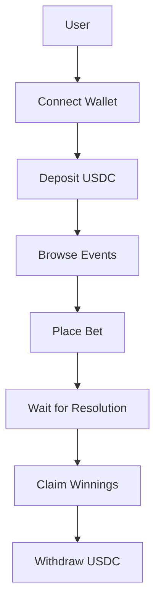

# User Guide

Complete guide for using the TRDEFI Prediction Market platform.

---

## Getting Started

### 1. Install MetaMask
- Download MetaMask browser extension from [metamask.io](https://metamask.io/)
- Create a new wallet or import existing wallet
- Securely store your seed phrase

### 2. Add Polygon Network
- Open MetaMask
- Click network dropdown
- Select "Add Network"
- Choose Polygon from the list
- Network added automatically

### 3. Get USDC
- Purchase USDC on an exchange
- Transfer USDC to your MetaMask wallet on Polygon network
- Minimum balance recommended: 10 USDC

---

## Platform Overview



---

## Step-by-Step Guide

### 1. Connect Wallet

1. Visit TRDEFI platform
2. Click "Connect Wallet" button
3. Select MetaMask from options
4. Approve connection in MetaMask popup
5. Wallet connected successfully

**Note:** Ensure you're on Polygon network before connecting.

---

### 2. Deposit USDC

1. Click "Deposit" button
2. Enter amount of USDC to deposit
3. Click "Confirm Deposit"
4. Approve transaction in MetaMask
5. Wait for transaction confirmation
6. Balance updated in platform

**Important:**
- Minimum deposit: 1 USDC
- Deposit is stored in smart contract vault
- You can withdraw anytime

---

### 3. Browse Events

1. Navigate to "Events" page
2. View available prediction events
3. Each event shows:
   - Question
   - Category
   - Deadline
   - Current pools (YES/NO)
   - Time remaining

**Event Status:**
- **Active:** Betting open
- **Ended:** Betting closed, waiting for resolution
- **Resolved:** Result announced, winnings claimable
- **Draw:** Event cancelled, bets refunded

---

### 4. Place Bet

1. Select an active event
2. Choose YES or NO
3. Enter bet amount
4. Click "Place Bet"
5. Approve transaction in MetaMask
6. Bet placed successfully

**Bet Rules:**
- Minimum bet: 1 USDC
- Maximum bet: 1000 USDC
- Must have sufficient vault balance
- Cannot bet after deadline

---

### 5. Wait for Resolution

1. Event deadline passes
2. LLM analyzes event outcome
3. Resolution submitted to blockchain
4. 24-hour challenge window starts
5. Multisig signers confirm or challenge
6. Event resolved automatically

**Resolution Process:**
- LLM checks multiple sources
- Resolution includes reasoning and source links
- Signers can challenge if resolution is incorrect
- Majority confirmation finalizes resolution

---

### 6. Claim Winnings

1. Navigate to "My Bets" page
2. Find resolved events with winning bets
3. Click "Claim Winnings" button
4. Approve transaction in MetaMask
5. Winnings added to vault balance

**Payout Calculation:**
```
Payout = (Your Bet / Total Winning Bets) × (Total Winning Bets + Total Losing Bets × 0.90)
```

**Example:**
- You bet 10 USDC on YES
- Total YES bets: 100 USDC
- Total NO bets: 50 USDC
- YES wins
- Your payout: (10/100) × (100 + 50 × 0.90) = 14.5 USDC
- Profit: 4.5 USDC

---

### 7. Withdraw USDC

1. Click "Withdraw" button
2. Enter amount to withdraw
3. Click "Confirm Withdrawal"
4. Approve transaction in MetaMask
5. USDC transferred to your wallet

**Important:**
- Can only withdraw available balance
- Withdrawal is instant
- No withdrawal fees (only network gas fees)

---

## Frequently Asked Questions

### General

**Q: What is TRDEFI?**
A: TRDEFI is a prediction market platform where users make YES/NO predictions on daily events.

**Q: Is this gambling?**
A: No, TRDEFI is an information-based prediction platform, not gambling.

**Q: Which network does TRDEFI use?**
A: TRDEFI operates on Polygon network for low gas fees.

**Q: What token is used?**
A: USDC (USD Coin) is used for all transactions.

---

### Betting

**Q: How do I place a bet?**
A: Connect wallet, deposit USDC, select event, choose YES/NO, enter amount, confirm.

**Q: What are the bet limits?**
A: Minimum 1 USDC, maximum 1000 USDC per bet.

**Q: Can I cancel my bet?**
A: No, bets cannot be cancelled once placed.

**Q: What happens if I bet on the wrong side?**
A: You lose your bet amount if your side loses.

---

### Payouts

**Q: How are payouts calculated?**
A: Parimutuel system: winners share the losing pool minus 10% platform fee.

**Q: When can I claim winnings?**
A: After event is resolved and your side wins.

**Q: What if no one bets on the other side?**
A: Event is declared DRAW and all bets are refunded.

**Q: Is there a platform fee?**
A: Yes, 10% of losing pool is taken as platform fee.

---

### Security

**Q: Is my funds safe?**
A: Funds are stored in audited smart contracts on Polygon blockchain.

**Q: Can the platform steal my funds?**
A: No, smart contracts are immutable and transparent.

**Q: What if there's a bug?**
A: Contract has pause mechanism for emergencies.

**Q: How do I report issues?**
A: Contact support or report on GitHub.

---

## Troubleshooting

### Common Issues

#### "Insufficient Balance"
- **Cause:** Not enough USDC in vault
- **Solution:** Deposit more USDC

#### "Transaction Failed"
- **Cause:** Network congestion or insufficient gas
- **Solution:** Wait and retry, or increase gas limit

#### "Event Not Found"
- **Cause:** Event ID incorrect or event deleted
- **Solution:** Refresh page and try again

#### "Cannot Claim Winnings"
- **Cause:** Event not resolved or bet lost
- **Solution:** Wait for resolution or check bet status

#### "Wallet Not Connected"
- **Cause:** MetaMask not connected or wrong network
- **Solution:** Connect wallet and switch to Polygon

---

## Tips and Best Practices

### Betting Strategy
1. Research events before betting
2. Check source links for resolution
3. Diversify bets across events
4. Don't bet more than you can afford to lose
5. Monitor challenge window for disputes

### Security Best Practices
1. Use strong MetaMask password
2. Never share seed phrase
3. Verify contract addresses
4. Check transaction details before approving
5. Use hardware wallet for large amounts

### Platform Usage
1. Check event deadlines before betting
2. Monitor resolution process
3. Claim winnings promptly
4. Keep track of transaction history
5. Report suspicious activity

---

## Contact and Support

### Resources
- **Documentation:** [docs.trdefi.com](https://docs.trdefi.com) (future)
- **GitHub:** [github.com/TRDEFI/pm-turkish](https://github.com/TRDEFI/pm-turkish)
- **Discord:** [discord.gg/trdefi](https://discord.gg/trdefi) (future)
- **Twitter:** [@TRDEFI](https://twitter.com/TRDEFI) (future)

### Support Channels
- Email: support@trdefi.com (future)
- Discord: #support channel
- GitHub Issues: Bug reports and feature requests

---

## Glossary

| Term | Definition |
|------|------------|
| **Parimutuel** | Betting system where all bets of a particular type are pooled together |
| **YES/NO** | Binary prediction options for events |
| **Pool** | Total amount bet on a particular side |
| **Resolution** | Determination of event outcome |
| **Challenge Window** | 24-hour period for signers to dispute resolution |
| **DRAW** | Event outcome where all bets are refunded |
| **Platform Fee** | 10% commission taken from losing pool |
| **Vault** | Smart contract holding user deposits |
| **Resolver** | Authorized entity that submits event resolutions |
| **Signer** | Multisig participant that confirms/challenges resolutions |

---

*Last Updated: 2026-05-21*
